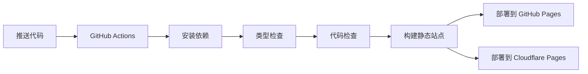

# 🚀 静态站点部署指南

通过GitHub Actions自动构建静态站点，完全避免25MB限制问题。

## ✨ 优势

- ✅ **完全静态** - 无服务器依赖
- ✅ **无大小限制** - 只部署静态文件
- ✅ **自动部署** - Git推送即自动构建
- ✅ **多平台支持** - GitHub Pages + Cloudflare Pages
- ✅ **超快速度** - 全球CDN加速

## 🔧 配置步骤

### 1. GitHub Pages 配置

1. **启用 GitHub Pages**
   - 访问：https://github.com/tigg2025/firstnav/settings/pages
   - Source：选择 "GitHub Actions"
   - 保存设置

2. **推送代码触发构建**
   ```bash
   git push origin main
   ```

3. **访问网站**
   - GitHub Pages 地址：https://tigg2025.github.io/firstnav
   - 通常2-3分钟后可访问

### 2. Cloudflare Pages 配置（可选）

1. **获取 API 令牌**
   - 访问：https://dash.cloudflare.com/profile/api-tokens
   - 创建令牌：权限包括 `Cloudflare Pages:Edit`

2. **配置 GitHub Secrets**
   - 访问：https://github.com/tigg2025/firstnav/settings/secrets/actions
   - 添加以下 Secrets：
     - `CLOUDFLARE_API_TOKEN`: 你的API令牌
     - `CLOUDFLARE_ACCOUNT_ID`: 你的账户ID

3. **推送触发双平台部署**
   - GitHub Pages: https://tigg2025.github.io/firstnav
   - Cloudflare Pages: https://firstnav.pages.dev

## 📊 构建流程



## 🌐 自定义域名配置

### GitHub Pages 域名

1. **添加 CNAME 文件**
   ```bash
   echo "yourdomain.com" > out/CNAME
   ```

2. **DNS 配置**
   ```
   类型: A
   名称: @
   值: 185.199.108.153
   
   类型: A  
   名称: @
   值: 185.199.109.153
   
   类型: CNAME
   名称: www
   值: tigg2025.github.io
   ```

### Cloudflare Pages 域名

在 Cloudflare 面板中：
1. Pages 项目设置 → 自定义域
2. 添加你的域名
3. Cloudflare 自动配置DNS

## 🔍 本地开发和测试

```bash
# 开发模式
pnpm dev

# 构建静态站点
pnpm build

# 本地预览静态站点
pnpm serve
# 访问 http://localhost:3000

# 完整检查
pnpm check
```

## 📱 部署优化

### GitHub Actions 优化

当前配置包括：
- ✅ 依赖缓存
- ✅ 类型检查
- ✅ 代码检查  
- ✅ 构建优化
- ✅ 部署到多平台

### 性能优化

静态站点特点：
- 📦 所有资源预构建
- ⚡ 无服务器冷启动
- 🌍 CDN 全球加速
- 📈 SEO 友好

## 🚨 故障排除

### 1. 构建失败

检查 GitHub Actions 日志：
- 访问：https://github.com/tigg2025/firstnav/actions
- 查看失败的工作流
- 检查错误信息

### 2. 页面404

确保：
- GitHub Pages 已启用
- 分支设置正确
- 等待DNS传播

### 3. 样式丢失

静态导出可能的问题：
- 检查相对路径
- 确保资源正确构建

## 📋 部署检查清单

- [ ] GitHub Pages 已启用
- [ ] 推送代码到 main 分支
- [ ] GitHub Actions 构建成功
- [ ] 网站可正常访问
- [ ] 所有页面功能正常
- [ ] 移动端显示正常
- [ ] 配置自定义域名（可选）

## 🎉 完成！

你的 AI 芯片导航网站现在是：

- ⚡ **超快静态站点**
- 🌍 **全球CDN加速** 
- 🔄 **自动部署更新**
- 🆓 **完全免费托管**

### 更新网站内容

```bash
# 修改代码
git add .
git commit -m "feat: update content"
git push origin main

# GitHub Actions 自动构建和部署
# 2-3分钟后更新生效
```

### 网站地址

- GitHub Pages: https://tigg2025.github.io/firstnav
- Cloudflare Pages: https://firstnav.pages.dev
- 自定义域名: https://yourdomain.com（配置后）

---

**现在就推送代码，享受全自动的静态站点部署吧！** 🚀 